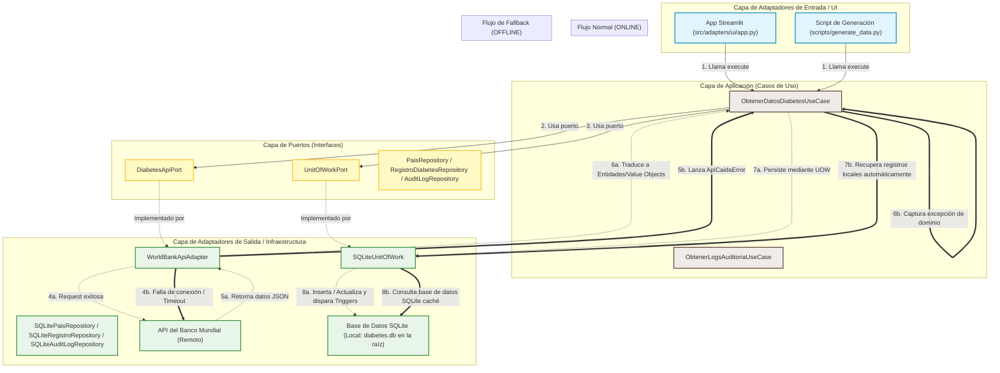

# Dashboard de Salud Pública: Diabetes en Centroamérica (Arquitectura Hexagonal)

Este proyecto implementa una aplicación interactiva en **Streamlit** para la monitorización de la **Prevalencia Anual de Diabetes** (% de la población de 20 a 79 años) en Centroamérica, centrándose en Nicaragua y países vecinos (Costa Rica, Honduras, Guatemala, El Salvador y Panamá).

El sistema está diseñado siguiendo los principios de la **Arquitectura Hexagonal (Puertos y Adaptadores)** y el **Diseño Guiado por el Dominio (DDD)** en Python, garantizando un desacoplamiento completo de la lógica de negocio frente a la infraestructura externa (base de datos SQLite, llamadas HTTP a la API del Banco Mundial y la interfaz de usuario de Streamlit).

---

##  Diagrama de la Arquitectura y Flujos de Datos

El siguiente diagrama detalla cómo se estructuran las capas del software y cómo fluyen las peticiones tanto en condiciones normales (**Flujo Normal ONLINE**) como en condiciones de error de red (**Flujo de Fallback OFFLINE**):



---

##  Estructura del Proyecto

El código está organizado bajo la estructura modular de Arquitectura Hexagonal:

```
├── .streamlit/               # Configuración del servidor de Streamlit
├── scripts/                  # Scripts auxiliares del proyecto
│   ├── generate_data.py      # Generador de datos CSV y precarga desde API a SQLite
│   └── migrate_db.py         # Script para ejecutar migraciones de base de datos
├── src/
│   ├── __init__.py           # Inicialización del paquete src
│   ├── domain/               # Capa de Dominio (Entidades, Excepciones, Eventos, etc.)
│   │   ├── __init__.py
│   │   ├── entities.py
│   │   ├── value_objects.py
│   │   ├── exceptions.py
│   │   └── events.py
│   │
│   ├── ports/                # Capa de Puertos (Interfaces abstractas)
│   │   ├── __init__.py
│   │   ├── api.py
│   │   ├── repositories.py
│   │   └── uow.py
│   │
│   ├── adapters/             # Capa de Adaptadores (Infraestructura)
│   │   ├── __init__.py
│   │   ├── api/              # WorldBankApiAdapter (Consumo HTTP)
│   │   │   ├── __init__.py
│   │   │   └── world_bank_adapter.py
│   │   ├── persistence/      # Repositorios SQLite, Unit of Work y Migraciones
│   │   │   ├── __init__.py
│   │   │   ├── migrations/   # Archivos de migración SQL
│   │   │   ├── migration_runner.py
│   │   │   ├── sqlite_repository.py
│   │   │   └── sqlite_uow.py
│   │   └── ui/               # Adaptador de interfaz de usuario (Streamlit)
│   │       ├── __init__.py
│   │       └── app.py        # Dashboard interactivo Streamlit
│   │
│   ├── application/          # Capa de Aplicación (Casos de Uso)
│   │   ├── __init__.py
│   │   └── services.py
│   │
│   └── composer.py           # Inyector de dependencias (Fábricas de composición)
│
├── bg_image.png              # Imagen de fondo en alta resolución para el dashboard
├── diabetes.db               # Base de Datos SQLite local (Generada automáticamente, ignorada por Git)
├── diabetes_data.csv         # Datos exportados (Generados automáticamente, ignorados por Git)
├── esquema.sql               # Esquema heredado (Legacy) de base de datos
├── requirements.txt          # Dependencias de Python necesarias
└── README.md                 # Documentación técnica del proyecto (Este archivo)
```

---

##  Base de Datos (SQLite)

El proyecto utiliza **SQLite** como motor de base de datos local para almacenar los registros de prevalencia de diabetes, países y el historial de auditoría de triggers.

### ¿Dónde se encuentra la Base de Datos?
El archivo de la base de datos se almacena localmente en el directorio raíz del proyecto con el nombre:
 **`diabetes.db`** (su ruta absoluta es `c:\DOCUMENTOS CLASES 4TO\Administración de Sistemas de Información\Diabetes\Diabetes\diabetes.db`).

### Ciclo de Vida y Migración Automática
* **Ignorada en Git**: Para evitar conflictos y subidas innecesarias de archivos locales dinámicos, `diabetes.db` está agregada en el archivo `.gitignore` y **no se almacena en el repositorio de GitHub**.
* **Auto-creación en Primer Inicio**: Si un usuario descarga el proyecto y lo ejecuta mediante Streamlit (`python -m streamlit run src/adapters/ui/app.py`), el sistema detectará la ausencia de `diabetes.db`, la **creará automáticamente en la raíz** y ejecutará todos los scripts SQL de migración ubicados en `src/adapters/persistence/migrations/`.
* **Sincronización Inicial**: Además de crear las tablas, el caso de uso se conectará a la API del Banco Mundial para recuperar y guardar los datos históricos de prevalencia de forma automática.
* **Precarga / Base de Datos Existente**: Si cuentas con un respaldo de la base de datos ya poblado y quieres utilizarlo en lugar de generar uno nuevo, simplemente copia tu archivo `diabetes.db` en la carpeta raíz del proyecto.


