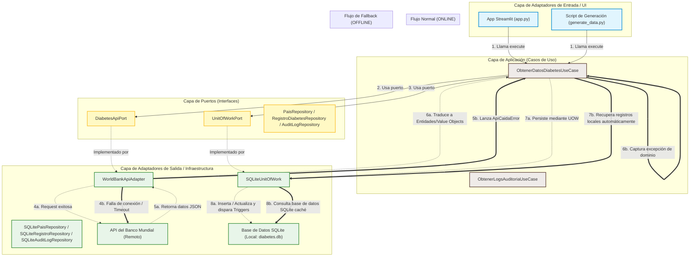

# Dashboard de Salud Pública: Diabetes en Centroamérica (Arquitectura Hexagonal)

Este proyecto implementa una aplicación interactiva en **Streamlit** para la monitorización de la **Prevalencia Anual de Diabetes** (% de la población de 20 a 79 años) en Centroamérica, centrándose en Nicaragua y países vecinos (Costa Rica, Honduras, Guatemala, El Salvador y Panamá).

El sistema está diseñado siguiendo los principios de la **Arquitectura Hexagonal (Puertos y Adaptadores)** y el **Diseño Guiado por el Dominio (DDD)** en Python, garantizando un desacoplamiento completo de la lógica de negocio frente a la infraestructura externa (base de datos SQLite, llamadas HTTP a la API del Banco Mundial y la interfaz de usuario de Streamlit).

---

##  Diagrama de la Arquitectura y Flujos de Datos

El siguiente diagrama detalla cómo se estructuran las capas del software y cómo fluyen las peticiones tanto en condiciones normales (**Flujo Normal ONLINE**) como en condiciones de error de red (**Flujo de Fallback OFFLINE**):



---

##  Estructura del Proyecto

El código está organizado bajo la estructura modular de Arquitectura Hexagonal:

```
├── .streamlit/               # Configuración del servidor de Streamlit
├── src/
│   ├── domain/               # Capa de Dominio (100% Pura, sin dependencias de infraestructura)
│   │   ├── entities.py       # Entidades principales (Pais, RegistroDiabetes)
│   │   ├── value_objects.py  # Objetos de Valor inmutables (Year, Prevalence, Population, Percentage, CountryCode)
│   │   ├── exceptions.py     # Excepciones personalizadas del dominio (ApiCaidaError, ValidationError, etc.)
│   │   └── events.py         # Sistema de Eventos de dominio (EventDispatcher, RegistroCreado, etc.)
│   │
│   ├── ports/                # Capa de Puertos (Interfaces abstractas)
│   │   ├── api.py            # Puerto para la API de datos (DiabetesApiPort)
│   │   ├── repositories.py   # Puertos para persistencia (PaisRepository, etc.)
│   │   └── uow.py            # Puerto para Unit of Work (UnitOfWorkPort)
│   │
│   ├── adapters/             # Capa de Adaptadores (Implementaciones de Infraestructura)
│   │   ├── api/              # WorldBankApiAdapter (Consumo HTTP de la API externa)
│   │   ├── persistence/      # SQLiteUnitOfWork e implementaciones de Repositorios SQLite
│   │   └── migration_runner.py # Sistema para aplicar el esquema de la base de datos local
│   │
│   ├── application/          # Capa de Aplicación (Casos de Uso)
│   │   └── services.py       # ObtenerDatosDiabetesUseCase y ObtenerLogsAuditoriaUseCase
│   │
│   └── composer.py           # Inyector de dependencias (Fábricas de composición)
│
├── app.py                    # Adaptador de entrada UI (Dashboard en Streamlit) - Sin lógica de negocio ni SQL
├── generate_data.py          # Script cliente de generación de datos CSV legacy y precarga de SQLite
├── esquema.sql               # Esquema heredado (Legacy) de base de datos
├── requirements.txt          # Dependencias de Python necesarias
└── README.md                 # Documentación técnica del proyecto (Este archivo)
```

---


